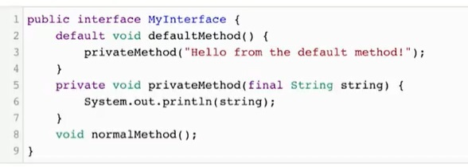

# Java SE Oriented Object Course

##### Table of contents
* [Introduction](#introduction) 
* [Technologies](#technologies)
* [Commands](#commands)
* [Syntax](#syntax)
* [Illustrations](#illustrations)

## Introduction
In this course we learn about:
* Interfaces
* Collections
* Override
* Difference between super and this
* Inherits
* Enumerations

## Technologies
* Java 8


## Commands:

| Function name | Description                    |
| ------------- | ------------------------------ |
| `add(Object)`      | This method is used to add an object to the collection.       |
| `contains(Object o)`   |  This method returns true if the collection contains the specified element.    | 
| `equals(Object o)`   | This method compares the specified object with this collection for equality.    | 
| `max()`   |  This method is used to return the maximium value present in the collection.     | 
| `size()`   |  This method is used to return the number of elements in the collection.     | 
| `remove(Object o)`   |  This method is used to remove the given object from the collection.    | 


## Syntax
##### Collection Demo
```java
class CollectionDemo {
    public static void main(String[] args)
    {
        int arr[] = new int[] { 1, 2, 3, 4 };
        Vector<Integer> v = new Vector();
        Hashtable<Integer, String> h
            = new Hashtable();
  
        v.addElement(1);
        v.addElement(2);
  
        h.put(1, "shoes");
        h.put(2, "shirts");
  
        System.out.println(arr[0]);
        System.out.println(v.elementAt(0));
        System.out.println(h.get(1));
    }
}
```

##### Abstract class
```
public abstract class Figura {
  abstract void dibujar();
}
```

##### Anonymous Class
```
User user = new User() {
  @Override
  public void showDataUser() {
    // Instrucciones...
  }
};
```
##### default and private Methods



## Illustrations

##### This is the result of the practice with static elements that we had use in diferent classes.

*********************************************
##### Using static final to use the array Months

*********************************************
##### Difference between stack memory and heap memory

*********************************************
##### In this practice we use encapsulation

*********************************************
##### Override
##### A constructor in a subclass using the inherit members of a superclass with different arguments.

*********************************************
##### An anonymous class example


*********************************************
##### Final result of the menu practice 

